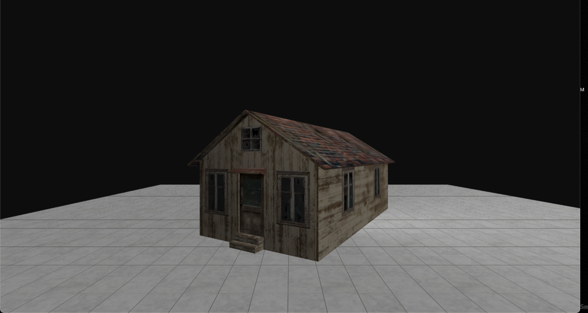
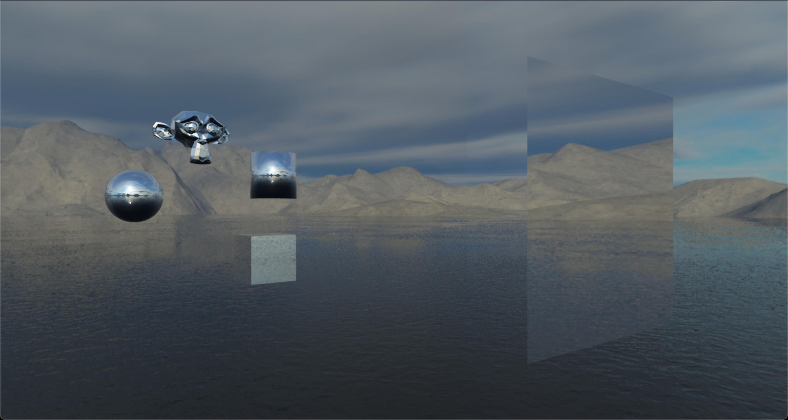

# Web3D

Web3D is a 3D Rendering Framework based on WebGL. This project is currently work in progress

The project is managed into modules.
1. web3d-core 
2. web3d-sandbox

 





## How to setup this repo on your machine?

Clone the project

```
  git clone https://github.com/Ashutosh421/Web3D.git
```

Install the node modules
``` 
  yarn
```

To run the sandbox
```
  yarn start:sandbox
```


